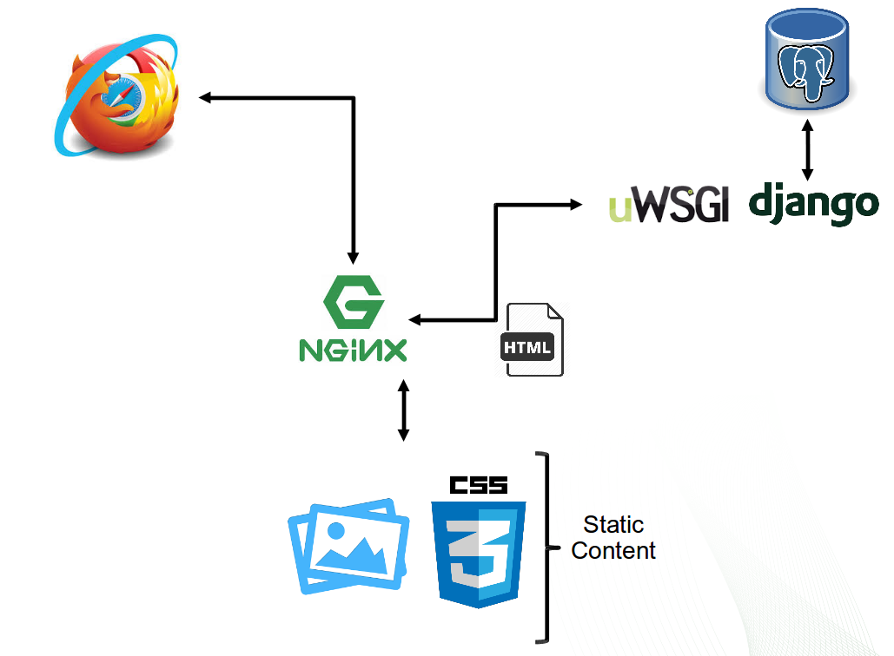
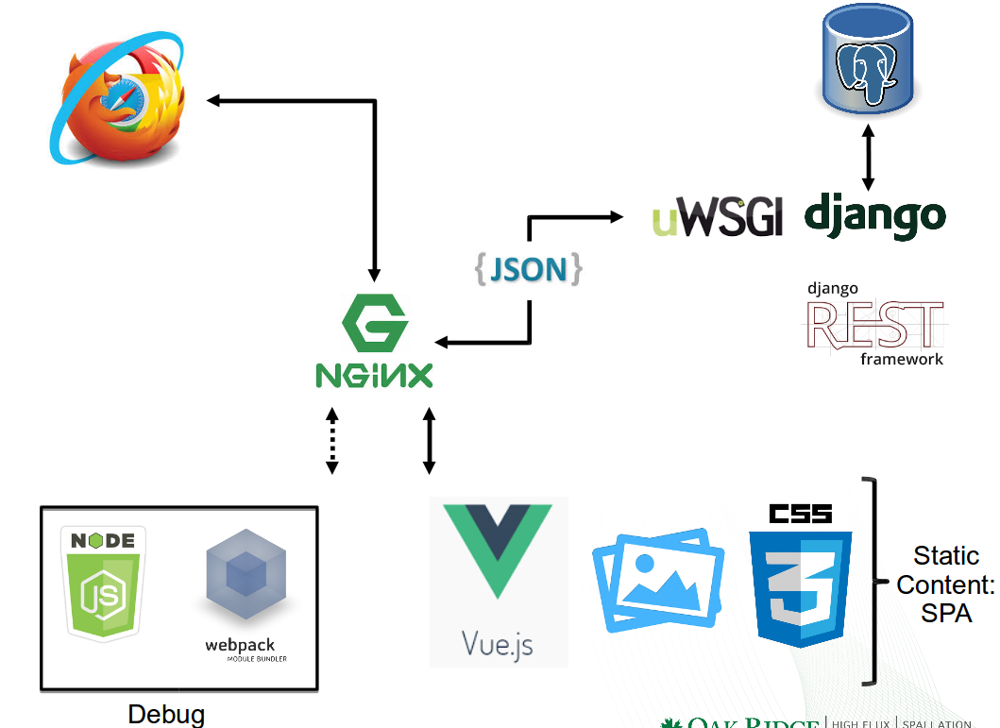

# DjangoBlog

Tutorial for a Django Blog

# Introduction

- High-level Python Web Framework
- Quickly Develop Applications
- Built-In Security:
  - Cross-Site Request Forgery (CSRF)
  - Cross site scripting (XSS)
  - SQL injection protection
  - etc...
- Scalable
- Built-In Administrative Interface

## MVC vs MTV

- Model = Model
- View = Template
- Controller = View

## Serving Django web pages

- Django has a builtin Django webserver:
  - Never ever use in PRODUCTION
  - It has not gone through security audits or performance tests
- Use:
  - NGINX / Apache to serve static pages and forward Django requests to:
  - Gunicorn / uWSGI (WSGI - Web Server Gateway Interface - the Python standard for web servers and applications.)
    - Apache mod_wsgi
    - NGINX - communicate with WSGI with unix sockets / http:
    
    `the web client <-> the web server <-> the socket <-> uwsgi <-> Django`

# Django Default

# Django REST Framework

